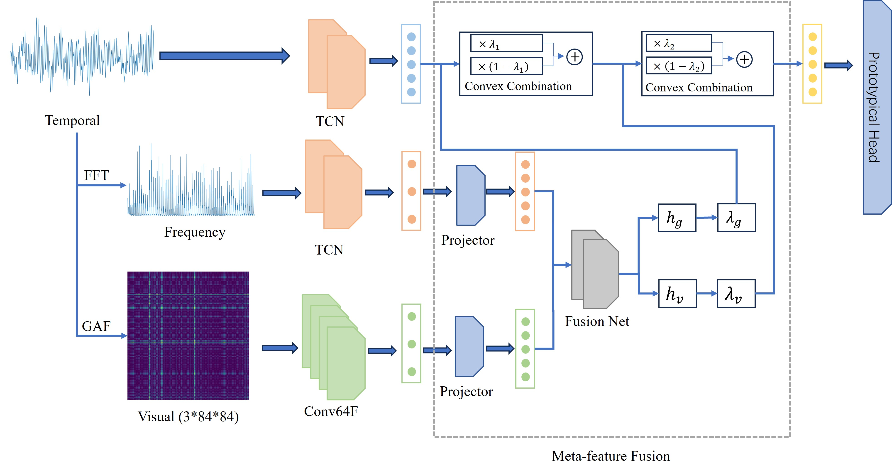

# 项目介绍
This project is the source code repository for the paper "MMPN-FD: Multi-modality Augmented Prototypical Network for Few-shot Fault Diagnosis Under Complex Work Conditions". 

The MMPN-FD model architecture is shown below:

# Installation
`pip install -r requirements.txt`

# Usage
## train 
`python main.py`

The above command executes model training with parameters N-way=5, K-shot=5, task_name=CL1 by default. If you need to modify the parameters, such as N-way, K-shot, task name, etc., please go to `config.py` to modify. Where `task_name` takes the values CL1, CL2, CL3, CL4, CB1, CB2, which correspond to the DL1, DL2, DL3, DL4, DB1, DB2 datasets in the paper, respectively. When `task_name` takes the value of CL1, CL2, CL3, CL4, `task_type` should be equal to 0, otherwise it is 1.

After training, the model was stored in the `/output/{Dataset_name}/{timestamp}` folder, with `Dataset_name` defaulting to CWRU. `timestamp` is the timestamp at which the training was performed.

## test
`python test.py -t |timestamp| -b |bool|`

Run the above command to perform model validation. Specify the timestamp of the trained model with the `-t` parameter. Read the best model when the `-b` parameter is True, and the final model when it is False, which is True by default.

# Metrics